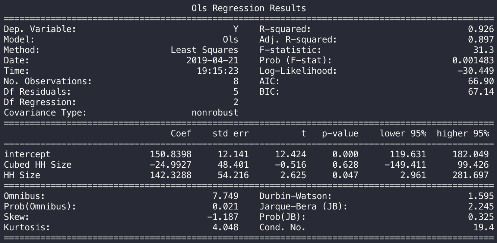

# smodels

An experiment in bringing Data Science and Statistics to Javascript.
All work is done on gitlab and mirrored on github:


## Installation
Install via npm
```
npm i smodels
```
https://gitlab.com/lostVkng/smodels
https://github.com/lostVkng/smodels


## Linear Regressions

smodels currently supports 3 linear regression models
1. Ordinary Least Squares
1. Generalized Least Squares
1. Weighted Least Squares

#### Setting up the regression
```javascript
// require it
const stats = require('smodels')

// sample data
let td = {
    endog: {'title':'Y', 'data':[150.697, 179.323, 203.212, 226.505, 249.633, 281.422, 256.2, 231.2]},
    exog: [
        {'title':'Cubed HH Size', 'data': [0, 0.04, 0.16, 0.36, 0.64, 1.00, 0.8, 0.9]},
        {'title':'HH Size', 'data': [0, 0.2, 0.4, 0.6, 0.8, 1.0, 0.8, 0.9]}
    ]
}

```


#### Ordinary Least Squares regression (OLS)
```javascript
// create and fit model
let model = new stats.Ols(td.endog, exog).fit()
```


#### Generalized Least Squares regression (GLS)
```javascript
// create and fit model
let model = new stats.Gls(td.endog, exog).fit()
```


#### Weighted Least Squares regression (WLS)
```javascript
// create and fit model
let model = new stats.Wls(td.endog, exog).fit()
```


#### Display Summary Results
```javascript
// add constant to exogenous values
let exog = stats.addConstant(td.exog)

// fit the model
let Ols = new stats.Ols(td.endog, exog).fit()

// Print summary
Ols.summary()
```


#### Prediction (in & out of sample)
```javascript
// add constant to exogenous values
let exog = stats.addConstant(td.exog)

// fit the model
let Ols = new stats.Ols(td.endog, exog).fit()

// In Sample
Ols.predict(Ols.X)

// Out of Sample
Ols.predict({exog:[ [1, 0.12, 0.8] ]})
```

#### Attributes
```javascript
// add constant to exogenous values
let exog = stats.addConstant(td.exog)

// fit the model
let model = new stats.Ols(td.endog, exog).fit()

console.log(model.params)

```

Attribute | Description
--------- | -----------
resid | Residual values
params | The beta coefficients of the fitted model
bse | The standard errors of the regression coefficients
btstats | The T-statistic of the regression coefficients
pvalues | The p-values of the regression coefficients
confInt | Confidence Interval for the regression coefficients
fvalue | F-statistic of the model
fProb | P-value of the F-statistic
llf | Likelihood function of the fitted model value
aic | Akaike's information criteria
bic | Bayes' information criteria
N | The number of observations in the dataset
K | The number of parameters in the model
X | Array of X value rows
rsq | R-squared of a model with an intercept
rsqAdj | Adjusted R-squared
omnibus | Omnibus normality test
skew | Skew
kurtosis | Kurtosis
jarqueBera | Jarque-Bera test for normality
durbinWatson | Durbin-Watson statistic
conditionNumber | Condition Number (via euclidean norm)
ssRegression | Sum Squared of the regression
ssResidual | Sum Squared of the regression
ssTotalCentered | Sum Squared total centered
ssTotalUncentered | Sum Squared total centered
mseRegression | Mean Square error of the Regression
mseResidual | Mean Squared error of residual
mseModel | Mean Squared error of model
ess | Explained Sum of Squares


## Logistic Regression
smodels also supports Logit regression for modeling binary dependent variables


#### Setting up the regression
```javascript
// require it
const stats = require('smodels')

// sample data
let td = {
    endog: {'title':'Y', 'data':[150.697, 179.323, 203.212, 226.505, 249.633, 281.422, 256.2, 231.2]},
    exog: [
        {'title':'Cubed HH Size', 'data': [0, 0.04, 0.16, 0.36, 0.64, 1.00, 0.8, 0.9]},
        {'title':'HH Size', 'data': [0, 0.2, 0.4, 0.6, 0.8, 1.0, 0.8, 0.9]}
    ]
}

```


#### Logit regression
```javascript
// create and fit model
let model = new stats.Logit(td.endog, exog).fit()
```

#### Display Summary Results
```javascript
// add constant to exogenous values
let exog = stats.addConstant(td.exog)

// fit the model
let model = new stats.Logit(td.endog, exog).fit()

// Print summary
model.summary()
```


#### Prediction (in & out of sample)
```javascript
// add constant to exogenous values
let exog = stats.addConstant(td.exog)

// fit the model
let model = new stats.Logit(td.endog, exog).fit()

// In Sample
model.predict(model.X)

// Out of Sample
model.predict({exog:[ [1, 0.12, 0.8] ]})
```

#### Attributes
```javascript
// add constant to exogenous values
let exog = stats.addConstant(td.exog)

// fit the model
let model = new stats.Logit(td.endog, exog).fit()

console.log(model.params)

```

Attribute | Description
--------- | -----------
resid | Residual values
params | The beta coefficients of the fitted model
bse | The standard errors of the regression coefficients
bzstats | The T-statistic of the regression coefficients
pvalues | The p-values of the regression coefficients
confInt | Confidence Interval for the regression coefficients
N | The number of observations in the dataset
K | The number of parameters in the model
X | Array of X value rows
llf | Likelihood function of the fitted model value
llnull | Likelihood function null model
llrPvalue | Likelihood Ratio p-value
pseudoRsq | McFadden's pseudo - R - Squared


## Motivation & Roadmap
smodels was created see if javascript could be used for data science. While there are a lot of things that I really enjoy about JS, I think it will be difficult for the language to be widely adopted for data science.

Floating point arithmetic
-------------------------
Javascript struggles with basic math because of the way it handles floating point arithmetic. For example:
```
> 0.1+.0.2
0.30000000000000004
```
While these issues can be solved with libraries such as Decimal and BigNumber it is still annoying for the average user. smodels takes care of internal calculations using DecimalJS but not every data calculation is completed inside the library. In larger calculations it becomes tedious to always write out something similar to the following. Since not every calculation is done in the library, its not ideal to force users to wrap their calculations leading to less readable and more difficult to maintain codebases.
```
// forced fix:
Decimal(0.1).plus(0.2).toNumber()
```

Pass by reference
-------------------------
Javascript objects and arrays pass by reference, while not as a big a deal as the arithmetic issue, I still find this leads to frequent errors. Python's pass by object reference is a bit more ideal for quick prototyping. There are ways to handle this mutability issue, and its doable but worth noting the limitations.

Roadmap
-------------------------
If I start to see demand for statistics in JS, and/or for this library, i'll focus on adding more models and expanding the library. If not, then it serves as a useful way for running a few regressions and experimenting in browser.
